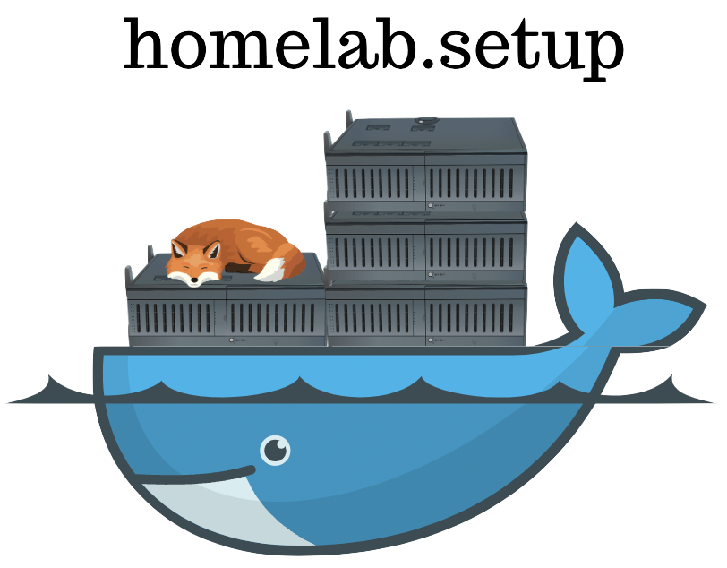

This repository hosts all the playbooks required to deploy and run my homelab. You have to bring your own hardware, Linux operating system, configuration secrets and *data* though.

My homelab is a single-node x64 (previously ARM) machine, and applications are deployed containerized via K3s (lightweight Kubernetes). Tailscale takes care of all the networking required for administration and deployments. Traefik handles ingress with automatic TLS certificates from Let's Encrypt.

## List of self-hosted applications

| App            | Purpose                                        | Project homepage                        |
|----------------|------------------------------------------------|-----------------------------------------|
| MySQL          | Database (common dependency for multiple apps) | https://dev.mysql.com/downloads/mysql/  |
| PostgreSQL     | Database (for apps that prefer Postgres)       | https://www.postgresql.org/             |
| Redis          | In-memory cache (sessions, queues)             | https://redis.io/                       |
| Firefly-III    | Personal finance                               | https://www.firefly-iii.org/            |
| Bookstack      | Documentation & Diary                          | https://www.bookstackapp.com/           |
| Vikunja        | Todo list                                      | https://vikunja.io/                     |
| Nextcloud      | Google Drive alternative                       | https://nextcloud.com/                  |
| Webtrees       | Family tree (genealogy)                        | https://www.webtrees.net/index.php/en/  |
| Audiobookshelf | Audiobook server (Audible alternative)         | https://www.audiobookshelf.org/         |
| Snibox         | Snippets organizer                             | https://github.com/MohamedElashri/Snibox|
| Memoet         | Modern spaced repetition system                | https://github.com/memoetapp/memoet     |
| Authelia       | Single sign-on & 2FA for all apps              | https://www.authelia.com/               |

## Architecture

K3s is a lightweight Kubernetes distribution that's perfect for single-node homelabs. Traefik (bundled with K3s) handles all ingress routing with automatic TLS via cert-manager and Let's Encrypt. Authelia sits in front of apps providing single sign-on with two-factor authentication.

All manifests are organized using Kustomize, and secrets are managed through Bitwarden - synced to the cluster via Ansible. The setup is fully declarative - adding a new application is just about creating a few YAML files and adding secrets to Bitwarden.

## Philosophy

The project was born as a hobby idea to organize knowledge. The core idea is to own the data and build amazing integrations that make everyday easy. As already mentioned, the homelab today hosts financial data lake, documentation & notetaking software, powerful to-do-listing tools, eBook and audiobook readers, file cloud, photo gallery, smart reminder & notification systems and so on!

## Deployment mechanism

Deployments happen whenever a PR gets merged to the `main` branch. GitHub Actions is used for all deployments and secrets are kept in Bitwarden. Whenever there's code merged, the CI runner:

1. Joins my Tailscale network
2. SSHs into the homelab via Tailscale SSH (no keys needed!)
3. Fetches the kubeconfig
4. Syncs secrets from Bitwarden to Kubernetes
5. Applies all manifests via `kubectl apply -k`

The whole setup requires just 5 GitHub secrets: `TAILSCALE_AUTHKEY`, `MACHINE_NAME`, and Bitwarden credentials. Idempotence is a strict requirement - running the same deployment twice should have no effect.

## Backup mechanism

All the application containers are mapped to a persistent storage location in the mounted HDD. And this giant data directory is being backed up to object storage (Backblaze B2 in my case). Encrypted, incremental backups - thanks to Duplicati.

## Evolution of the host machine

Yeah I'm a [one-machine](https://thume.ca/2023/01/02/one-machine-twitter/) fan.

1. 1GB DigitalOcean droplet
    - The now-archived [repository](https://github.com/rounakdatta/homeserver.setup) used to deploy applications natively (non-containerized) and given memory was limited, very few applications were deployed.
    - Since DO droplets have dedicated IPv4, exposing services publicly was not at all a concern.
2. Raspberry Pi 4
    - The Raspberry Pi performed really well in the initial 3 months of setting up, until summer heat waves spoiled the party.
    - Pis being single-board computers tend to get very hot when overworking.
    - The Pi (ARM) setup was very efficient on power and had an external USB-connected HDD for storage.
    - The Pi ran DietPi - a stripped down Debian-based operating system. With 8GB of memory, it ran a large number of applications really well, although response times were quite high on average.
3. Dell Latitude E6400
    - Migrating to a x64 (AMD64) old laptop was mostly trivial. The Dell machine runs Ubuntu server.
    - CPU, in comparison to the Pi is way more faster and resulted to slightly better response times.
    - Being a laptop, the machine provides battery backup to some extent and also a screen for urgent debugging.
    - However the laptop being decade-old, it tends to heat up a lot and needs active environmental cooling.
4. ASUS Desktop (gaming PC)
    - The second-hand-purchased gaming desktop sports i5 7th generation and 16GB RAM (early 2018 model).
    - Has powerful motherboard with efficient cooling and power unit.
    - Nextcloud, Photoprism, Duplicati performance has clear visible improvements upon migration to this desktop homelab.
5. VM (current)
    - Migrated from Nomad to K3s (lightweight Kubernetes) for better ecosystem support.
    - Tailscale SSH eliminates the need for managing SSH keys.
    - All secrets managed in Bitwarden, synced automatically during deployments.
    - Traefik + cert-manager handles ingress and TLS certificates.

## Future scopes

With the migration to K3s complete, the next focus areas are:
- Adding more applications back (Immich for photos, Miniflux for RSS)
- Metric collection and monitoring (Prometheus + Grafana)
- Exploring multi-node K3s with Oracle Cloud's free ARM instances
- Distributed storage solutions (Longhorn, SeaweedFS)
